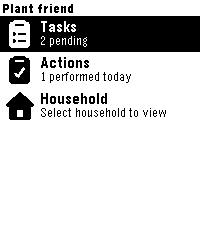
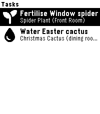
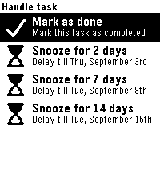

# Plant friend for Pebble

A Pebble watchapp for [Plant friend](https://myplantfriend.com) that helps you keep track of your plant care schedule directly from your wrist.

## Features

* **Task Management**: View pending plant care tasks (watering, fertilizing, misting, cleaning, etc.).
* **Quick Actions**: Mark tasks as done, snooze them for later, or undo completed actions.
* **Multi-Household Support**: Easily toggle between and manage multiple households associated with your account.
* **Compact UI**: Optimized custom menu layout designed specifically for Pebble's e-paper display.

## Prerequisites

To use this app, you will need:
1. An active account on [myplantfriend.com](https://myplantfriend.com).
2. A generated **Long-Lived Access Token** from your account settings.

## Setup & Configuration

1. **Generate your Token**:
   * Log into your account at [myplantfriend.com](https://myplantfriend.com).
   * Navigate to your Settings -> Tokens and create a new **Long-Lived Access Token**.
2. **Configure the App**:
   * Instal from the [Repebble store](https://apps.repebble.com/0af0a40d63c34ef4bb110074) or install the `.pbw` bundle on your Pebble smartwatch.
   * Open the Pebble app on your phone.
   * Go to the **App Settings** for Plant friend and paste your API token.

## Screenshots





## Building from Source

This project is built using the Pebble SDK.

### Prerequisites
* [Pebble SDK](https://developer.rebble.io/) (or Rebble Toolchain)

### Build Steps

```bash
# Clone the repository
git clone [https://github.com/vincentezw/plantfriend-pebble.git](https://github.com/your-username/plantfriend-pebble.git)
cd plantfriend-pebble

# Build the project
pebble build

# Install on an emulator or connected device
pebble install --emulator basalt
# OR for physical hardware:
# pebble install --phone <PHONE_IP>
